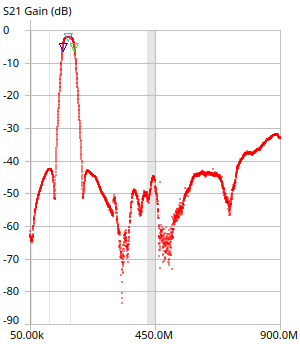

## 140 MHz Band-Pass Filter KiCAD PCB Files

This repository contains the files associated with the creation of a 
Band-Pass Filter ideal for NOAA APT Satellite and UHF Amateur Radio reception.

### Bill of Materials
- SMA PCB Mount connectors, available from various online sellers
  - Specific to this project, SMA Female Jack Right Angle PCB Mount RF Connectors were used
- [140-BPF+ chip from MiniCircuits](https://www.minicircuits.com/WebStore/dashboard.html?model=RBP-140%2B)

## Board Images

## Analysis

The board performs extremely closely to the manufacturer's specifications.

The 140-BPF+ datasheet can be reviewed above, but the analysis has been
independently validated with the following results:

